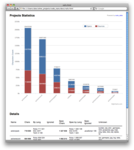
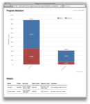
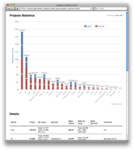
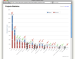

# Code Statistics and the Power Law

Last week I used [CodeStats](https://github.com/alexeypetrushin/code_stats), Code Statistic analyzer
to examine my own and some other projects. Let's look at use cases: complexity of Rails libraries,
comparison of some Open Source projects and MongoMapper vs Mongoid

## Why may You need such numbers and graphs?

I used it because:

- I wanted to find simple open source game project to examine and play with. There are lots of such
projects and because I have very little free time I need a way to measure how big and complex they are
and select a simple one. So this tool can be useful to roughly **estimate tons of unknown projects** in
different languages. You can also **estimate how healthy they are** by looking at the code / specs ratio.

- I also was curious how my own projects are compared to other well know projects. How big the source
code are, how well is it covered with specs.

- I wanted a way to find most heavy and most useful parts of code in my projects, in order to try to
eliminate the first and pay more attention to the second (see next section).

## Power law, efficiency and decision making

 You probably noticed that if You
compare multiple projects the graph almost always looks like this image. The code distribution is uneven,
this distribution is known as the [Power law](http://en.wikipedia.org/wiki/Power_law) (it also known
as the Pareto principle and the 80-20 rule).

Why is this interesting and important? Because it affects Your efficiency - the source code of Your
projects fall under the [Power law](http://en.wikipedia.org/wiki/Power_law), with the following
consequence: **20% of code responsible for 80% of app value**, other 80% of code are responsible only
for 20% of value.

How can we use this? I would like to use a detached sample to better illustrate this - sales also
fall under this law - 80% of income are come from 20% of clients. And one of the salesperson's
rule of effectiveness:

1. Analyze sales and find those 20% of clients.
2. Pay more attention to them and less to other 80%.

The same are valid for the code, and You can use this tool to analyze it find those important 20% of
code and pay more attention to it and less to the other.

There's also the second consequence: **80% of code are produced by 20% of application's modules**.
Note: these 20% - it's the different code, not the same as the "important 20% part".

Also would like to illustrate this with sales example - there are 20% of clients that causes 80% of
troubles, and if You want to be efficient - You need to pay attention to the quality of the client
base and sometimes drop those clients that produce more troubles than the money. Back to
code - **try to cut fat parts**, [this tool](https://github.com/alexeypetrushin/code_stats) can help
to find it.

And, the last consequence, a philosophical one - no matter what You do the project's code always will
comply to Power law, and there always will be 20/80 ratio :).

## Sample - analysis of some of my personal project

Here’s sample analysis of some of my old and abandoned project, it's a very simple solution for small
businesses (site, forum, e-commerce, organizer). It builded as a lots of cooperated modules, let's
look at it's code statistics (see first image):

How to find those important 20%? I don't know, but I belive that in general application code
is more important than code of support libraries.

Let's divide app and support libraries, see image below - green tick - business logic, red cross -
framework libraries, strikethrough - some other libraries, ignored.

Totals: libs: 283 000 vs. app: 114 000.

What to do next? Also don't know, but believe it would be good to do following:

- For the app: try to even more distill app logic and move code to support libraries.
- For libraries: try to replace our own custom libraries with public libraries supported by
other developers.

Tags : Complexity, Statistics
Date : 2011/8/1